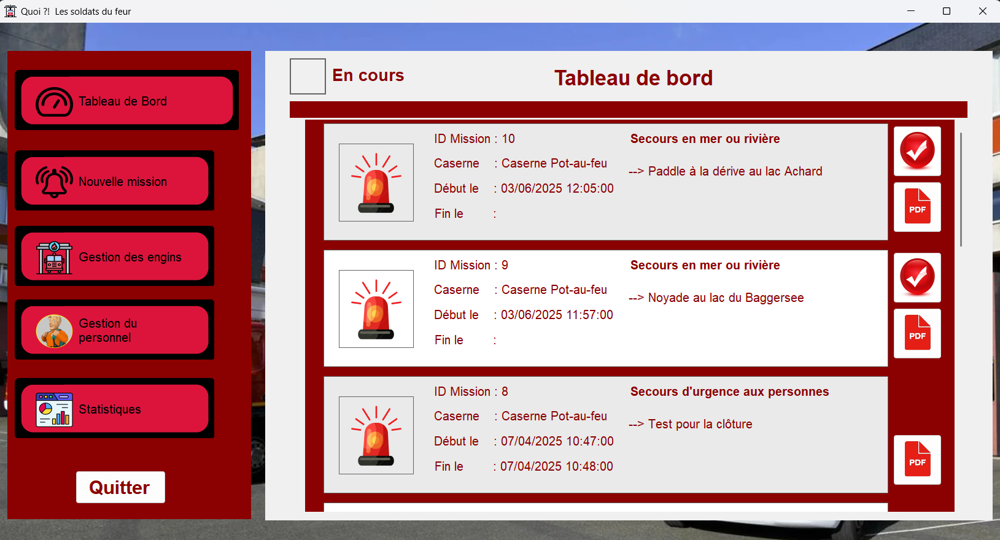
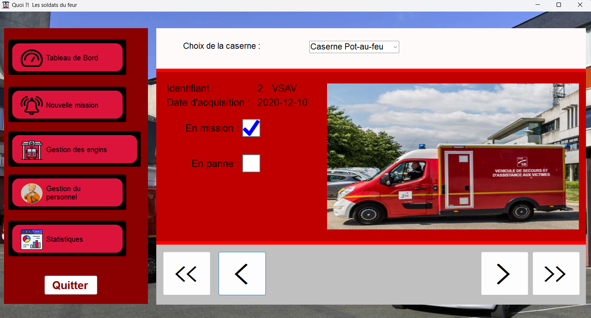
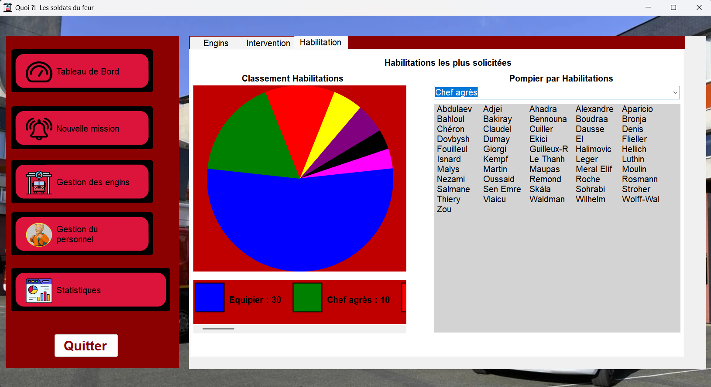

# SAE Caserne

Projet de fin de 1ère année de **BUT Informatique** à l’**IUT d’Illkirch**.

Le but de ce projet était de développer une **application de gestion d’une base de données** pour une **caserne de pompiers**.  
L’application permet de gérer les pompiers, les véhicules, les interventions et les missions au sein d’une caserne, avec une interface simple et intuitive.


## Captures d'écran

### Tableau de bord


### Gestion des engins


### Statistiques



## Technologies utilisées

- **Langage :** C#  
- **Base de données :** SQLite  
- **IDE :** Visual Studio  
- **ORM / Bibliothèques :** System.Data.SQLite (via NuGet)


## Équipe

- Nombre de développeurs : **3**  
- Durée du projet : **7 semaines**


## Installation et exécution

1. **Cloner le dépôt :**
    ```bash
    git clone https://github.com/mon-utilisateur/sae-caserne.git
    cd sae-caserne
2. Ouvrir le projet :
    Lancer Visual Studio
    Ouvrir la solution .sln du projet

3. Installer SQLite :
    Aller dans Outils → Gestionnaire de packages NuGet → Gérer les packages pour la solution
    Rechercher et installer : System.Data.SQLite

4. Lancer l’application :
    Cliquer sur ▶️ Exécuter dans Visual Studio


## Fonctionnalités principales

- Gestion des pompiers (ajout, suppression, modification, consultation)  
- Suivi et gestion des véhicules  
- Enregistrement et gestion des interventions et missions  
- Recherche et filtrage des données  
- Consultation rapide des informations importantes
